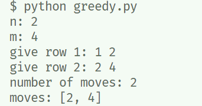

# Mediaire Challenge Solution

I have implemented the greedy solution which is provided in the `greedy.py` file. The solution basically uses BFS over the grid to find connected tiles and tries to find the tile color which would optimally increase the number of connected tiles.
Due to time constraints, I couldn't implement a optimal solution.

### Steps:
* Install the packages: 

`pip install -r requirements.txt`
* Run the solution: 

`python greedy.py`

* Test the solution: 

`pytest`